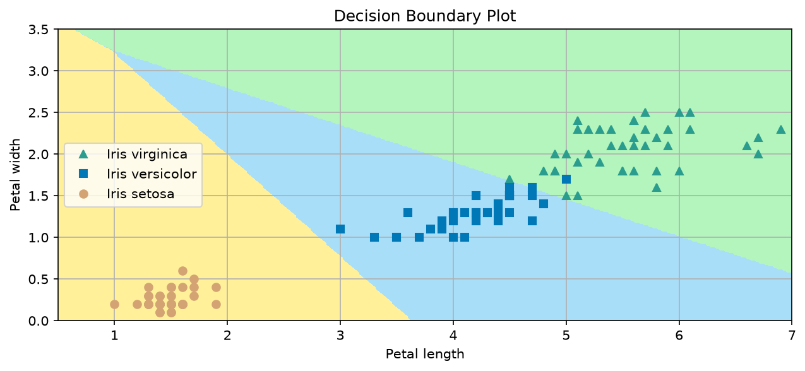

# Softmax Regression from Scratch (NumPy)

A from-scratch implementation of **softmax regression** in **NumPy**, built without Scikit-Learn. The project focuses on understanding the math and implementation details behind multiclass classification, including stable softmax, gradient computation, L2 regularization, and batch gradient descent with validation-based model selection.

## Overview

This project implements softmax regression for multiclass classification and tests it on the **Iris dataset**. The goal was not only to obtain strong accuracy, but also to understand how the algorithm works internally:

* how logits are computed,
* how softmax turns logits into probabilities,
* how cross-entropy loss is optimized,
* how gradients are derived and applied,
* how to keep training numerically stable,
* how to track model quality on a validation set.

## Features

* One Hot Encoder and StandardScaler from scratch
* Softmax regression implemented from scratch with NumPy
* Batch gradient descent
* Numerically stable softmax
* One-hot encoded targets
* L2 regularization
* Validation split
* Best-model checkpointing based on validation accuracy
* Final evaluation on test set

## Results

On the Iris classification task, the model achieved:

* **Validation accuracy:** 1.0
* **Test accuracy:** 0.93
* **Test accuracy (scikit-learn LogisticRegression, for comparison):** 0.9



These numbers are reported with accuracy only, so they should be interpreted as a simple baseline metric rather than a complete evaluation.

## Implementation notes

A few important details in the implementation:

* The softmax computation subtracts the maximum logit per sample before applying `exp`, which helps prevent overflow.
* The gradient is computed in vectorized form for efficiency.
* Bias terms are not regularized.
* The training loop uses batch gradient descent.
* The best model is selected using validation accuracy.

## Project structure

```text
softmax_reg/
├── assets/
│   └── decision_boundary.png
├── notebook/
│   └── softmax_regression.ipynb
├── src/
│   └── softmax.py
├── .gitignore
├── LICENSE
├── README.md
└── requirements.txt                    
```

## Requirements

See `requirements.txt`. Install with:
    pip install -r requirements.txt

## How to run

1. Install dependencies: `pip install -r requirements.txt`
2. Launch Jupyter **from the `notebook/` directory** — the import of `src/softmax.py` relies on the notebook's working directory being `notebook/`.
3. Open `softmax_regression.ipynb` and run all cells.

## License

This project is licensed under the MIT License — see [LICENSE](LICENSE) for details.
